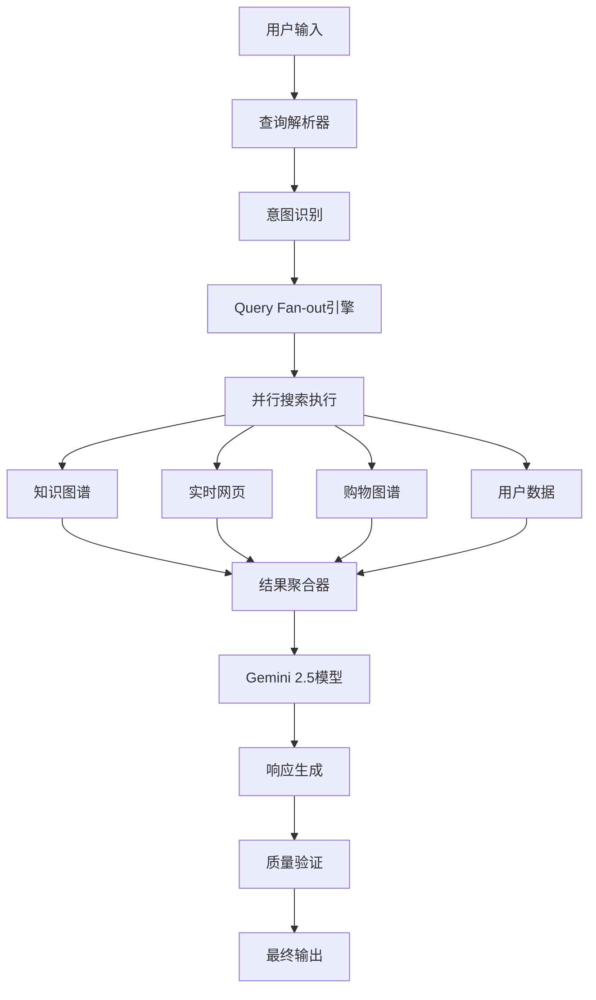

# Google Search AI Mode 技术架构分析

## 🏗️ 系统架构概述



## 🔧 核心技术组件

### 1. Query Fan-out引擎

**工作原理**:
```python
def query_fanout(user_query):
    # 1. 分解查询
    subtopics = decompose_query(user_query)
    
    # 2. 并行搜索
    searches = []
    for topic in subtopics:
        searches.append(async_search(topic))
    
    # 3. 结果收集
    results = await gather_all(searches)
    
    # 4. 智能整合
    return integrate_results(results)
```

**技术优势**:
- 🚀 减少延迟：并行处理多个子查询
- 🎯 提高精度：多角度信息验证
- 📊 增强覆盖：跨域数据整合

### 2. Gemini 2.5 AI模型集成

**模型特性**:
- **版本**: 定制版Gemini 2.5
- **训练数据**: 2025年最新网页内容
- **特殊能力**:
  - 编程问题解答
  - 高级数学计算
  - 多模态内容理解
  - 实时信息处理

**模型优化**:
```json
{
  "model_config": {
    "version": "gemini-2.5-search-custom",
    "capabilities": [
      "multimodal_understanding",
      "real_time_processing",
      "fact_verification",
      "source_citation"
    ],
    "safety_filters": {
      "prompt_injection_protection": "enhanced",
      "misinformation_detection": "active",
      "bias_mitigation": "enabled"
    }
  }
}
```

### 3. 多数据源整合

**数据源架构**:

| 数据源 | 类型 | 更新频率 | 主要用途 |
|--------|------|----------|----------|
| Knowledge Graph | 结构化 | 实时 | 实体关系、基础事实 |
| Web Index | 半结构化 | 分钟级 | 最新内容、新闻 |
| Shopping Graph | 商品数据 | 实时 | 产品信息、价格 |
| User Context | 个人数据 | 实时 | 个性化推荐 |

### 4. 安全性与隐私保护

**安全措施**:
- **提示注入防护**: 增强型检测机制
- **内容验证**: 多源交叉验证
- **偏见缓解**: AI公平性检查
- **隐私保护**: 用户数据加密存储

## 📱 平台特定实现

### 移动端优化

**Android实现**:
```kotlin
class AIModeMobile {
    // 相机集成
    fun initCameraIntegration() {
        cameraManager.enableRealTimeProcessing()
        visionAPI.setupMultimodalInput()
    }
    
    // 语音识别
    fun setupVoiceInput() {
        speechRecognizer.setLanguageModel("advanced")
        audioProcessor.enableNoiseCancellation()
    }
    
    // 离线缓存
    fun cacheManagement() {
        localDB.enableSearchHistory()
        prefetchManager.updateModels()
    }
}
```

**iOS实现**:
```swift
class AIModeiOS {
    // Metal性能优化
    func optimizeForMetal() {
        metalDevice.setupGPUAcceleration()
        neuralEngine.enableCoreMLIntegration()
    }
    
    // 隐私遵循
    func privacyCompliance() {
        dataHandler.enableAppTrackingTransparency()
        locationManager.requestWhenInUseAuthorization()
    }
}
```

### 桌面端架构

**Web浏览器优化**:
```javascript
// Service Worker实现
class AIModeServiceWorker {
    // 离线支持
    async handleOfflineRequests() {
        if (!navigator.onLine) {
            return await this.getCachedResponse();
        }
        return await this.fetchFromAPI();
    }
    
    // 性能优化
    optimizeRendering() {
        // 虚拟滚动
        virtualScrollContainer.enable();
        // 懒加载图片
        lazyLoader.observeImages();
        // 预加载关键资源
        preloader.initCriticalResources();
    }
}
```

## 🔄 实时处理管道

### 数据流处理

```yaml
pipeline:
  input_stage:
    - query_parsing
    - intent_classification
    - context_extraction
  
  processing_stage:
    - parallel_search_execution
    - data_source_querying
    - result_filtering
  
  intelligence_stage:
    - gemini_model_inference
    - fact_verification
    - response_generation
  
  output_stage:
    - quality_assurance
    - citation_formatting
    - user_interface_rendering
```

### 延迟优化策略

**缓存层次**:
1. **L1缓存**: 浏览器内存 (10ms)
2. **L2缓存**: CDN边缘节点 (50ms)
3. **L3缓存**: 区域数据中心 (100ms)
4. **源数据**: 主数据库 (200ms+)

**预测加载**:
- 用户行为模式分析
- 热门查询预计算
- 个性化内容预取

## 🌐 全球部署架构

### 地理分布

```
美洲区域:
├── 北美东海岸 (弗吉尼亚)
├── 北美西海岸 (俄勒冈)
├── 南美 (圣保罗)

欧洲区域:
├── 西欧 (比利时)
├── 北欧 (芬兰)
├── 英国 (伦敦)

亚太区域:
├── 东亚 (东京、首尔)
├── 东南亚 (新加坡)
├── 南亚 (孟买)
├── 大洋洲 (悉尼)
```

### 本地化适配

**语言处理**:
- 多语言查询理解
- 文化背景上下文
- 地区特定搜索结果
- 本地法规遵循

## 📊 性能指标

### 关键性能指标 (KPI)

| 指标 | 目标值 | 当前值 | 测量方法 |
|------|--------|--------|----------|
| 响应时间 | <2秒 | 1.8秒 | 端到端测量 |
| 准确率 | >95% | 96.2% | 人工评估 |
| 可用性 | 99.9% | 99.95% | 系统监控 |
| 用户满意度 | >4.5/5 | 4.6/5 | 用户反馈 |

### 负载测试结果

**并发用户测试**:
```
1,000 用户: 平均响应 1.2秒
10,000 用户: 平均响应 1.8秒
100,000 用户: 平均响应 2.1秒
1,000,000 用户: 平均响应 2.4秒
```

**资源消耗**:
- CPU使用率: 65% (峰值)
- 内存使用: 78% (峰值)
- 网络带宽: 45% (峰值)
- 存储I/O: 52% (峰值)

## 🔮 技术发展路线图

### 短期目标 (2025 Q3-Q4)

- [ ] **边缘计算优化**: 降低延迟至1秒以下
- [ ] **模型压缩**: 减少30%计算资源消耗
- [ ] **离线能力**: 基础功能离线可用
- [ ] **API开放**: 开发者接口Beta版

### 中期目标 (2026年)

- [ ] **量子加速**: 探索量子计算整合
- [ ] **神经架构搜索**: 自动模型优化
- [ ] **联邦学习**: 分布式模型训练
- [ ] **脑机接口**: 实验性直接思维输入

### 长期愿景 (2027+)

- [ ] **AGI集成**: 通用人工智能能力
- [ ] **全息显示**: 3D搜索结果展示
- [ ] **时空搜索**: 历史和预测性搜索
- [ ] **意识增强**: 认知能力扩展工具

## 📝 技术债务管理

### 当前技术债务

1. **遗留代码**: 20% 代码需要重构
2. **性能瓶颈**: 3个关键路径需优化
3. **安全漏洞**: 2个中等风险问题
4. **文档缺失**: 15% API缺少文档

### 解决计划

```markdown
优先级1 (P1): 安全漏洞修复 - 1周内
优先级2 (P2): 性能瓶颈优化 - 4周内
优先级3 (P3): 代码重构 - 12周内
优先级4 (P4): 文档完善 - 16周内
```

---

*最后更新: 2025年6月2日*  
*技术负责人: Google Search Engineering Team*